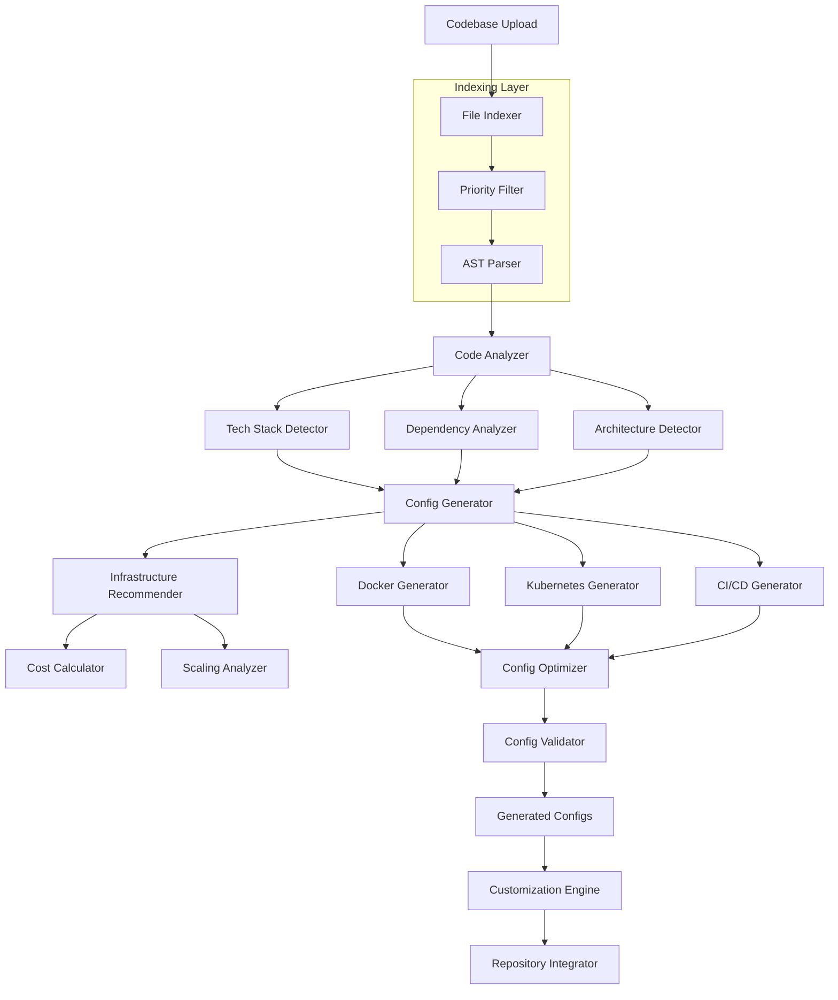

# AutoInfra Agent Design Document

## Overview

The AutoInfra Agent is an intelligent infrastructure automation system that analyzes codebases and generates optimized Docker configurations, Kubernetes manifests, CI/CD pipelines, and infrastructure recommendations. The system uses static code analysis, dependency detection, and machine learning-based recommendations to provide zero-touch infrastructure setup for modern applications.

## Architecture

The system follows a microservices architecture with clear separation between analysis, generation, and recommendation engines:



### Core Components

1. **File Indexer**: Creates efficient index of codebase structure and prioritizes files
2. **AST Parser**: Generates Abstract Syntax Trees for critical files only
3. **Code Analyzer**: Analyzes indexed codebase to extract metadata
4. **Config Generator**: Creates infrastructure configurations based on analysis
5. **Infrastructure Recommender**: Provides intelligent recommendations for optimization
6. **Config Optimizer**: Optimizes generated configurations for performance and cost
7. **Customization Engine**: Allows user modifications and preferences
8. **Repository Integrator**: Handles integration with version control systems

## Indexing Strategy

### Smart File Processing for Large Codebases

For codebases with thousands of files, we implement a multi-stage indexing approach:

#### Stage 1: File System Indexing

- **Fast Scan**: Traverse directory structure without reading file contents
- **Pattern Matching**: Identify file types by extensions and naming patterns
- **Size Filtering**: Skip or deprioritize very large files (>10MB)
- **Ignore Rules**: Respect .gitignore and common ignore patterns (node_modules, .git, etc.)

#### Stage 2: Priority Classification

```typescript
interface FilePriorityClassifier {
  classifyFile(path: string, stats: FileStats): ImportanceScore;

  // Priority levels (highest to lowest):
  // 1. Package/dependency files (package.json, requirements.txt, pom.xml)
  // 2. Configuration files (docker, k8s, CI/CD configs)
  // 3. Entry points (main.js, app.py, index.ts, Program.cs)
  // 4. Database schemas and migrations
  // 5. API definitions (OpenAPI, GraphQL schemas)
  // 6. Build configurations (webpack, vite, etc.)
  // 7. Environment configs (.env templates)
  // 8. Regular source code files
  // 9. Test files (for framework detection)
  // 10. Documentation and assets (lowest priority)
}
```

#### Stage 3: Selective AST Parsing

- **Critical Files Only**: Parse AST for top 50-100 most important files
- **Language-Specific Parsers**: Use appropriate parsers (TypeScript, Python, Java, etc.)
- **Incremental Parsing**: Parse additional files only if needed for analysis
- **Caching**: Cache AST results to avoid re-parsing

#### Stage 4: Dependency Graph Construction

```typescript
interface DependencyGraphBuilder {
  buildGraph(
    priorityFiles: PriorityFileMap,
    astCache: Map<string, AST>
  ): DependencyGraph;

  // Analyzes:
  // - Import/require statements
  // - Package dependencies
  // - Service-to-service communication
  // - Database connections
  // - External API calls
}
```

### Performance Optimizations

#### Parallel Processing

- **Worker Threads**: Use Node.js worker threads for CPU-intensive parsing
- **Streaming**: Process large files in chunks
- **Concurrent Analysis**: Analyze different file types simultaneously

#### Memory Management

- **Lazy Loading**: Load file contents only when needed
- **AST Pruning**: Keep only relevant AST nodes in memory
- **Garbage Collection**: Actively clean up processed data

#### Caching Strategy

```typescript
interface CacheManager {
  // File-level caching
  getCachedAST(filePath: string, lastModified: Date): AST | null;
  setCachedAST(filePath: string, ast: AST, lastModified: Date): void;

  // Analysis-level caching
  getCachedAnalysis(codebaseHash: string): AnalysisResult | null;
  setCachedAnalysis(codebaseHash: string, result: AnalysisResult): void;

  // Incremental updates
  invalidateCache(changedFiles: string[]): void;
}
```

## Components and Interfaces

### Code Analyzer Component

```typescript
interface CodeAnalyzer {
  indexCodebase(codebase: CodebaseInput): Promise<CodebaseIndex>;
  analyzeCodebase(index: CodebaseIndex): Promise<AnalysisResult>;
  detectTechStack(index: CodebaseIndex): TechStackInfo;
  analyzeDependencies(packageFiles: PackageFile[]): DependencyInfo;
  detectArchitecture(index: CodebaseIndex): ArchitectureInfo;
}

interface CodebaseIndex {
  fileIndex: FileIndexEntry[];
  priorityFiles: PriorityFileMap;
  astCache: Map<string, AST>;
  dependencyGraph: DependencyGraph;
  statistics: CodebaseStatistics;
}

interface FileIndexEntry {
  path: string;
  type: FileType;
  size: number;
  importance: ImportanceScore;
  language?: string;
  lastModified: Date;
}

interface PriorityFileMap {
  packageFiles: string[];
  configFiles: string[];
  entryPoints: string[];
  schemas: string[];
  dockerFiles: string[];
  cicdFiles: string[];
}

interface ImportanceScore {
  score: number;
  reasons: string[];
  category: "critical" | "important" | "normal" | "ignore";
}

interface AnalysisResult {
  techStack: TechStackInfo;
  dependencies: DependencyInfo;
  architecture: ArchitectureInfo;
  buildRequirements: BuildRequirements;
  runtimeRequirements: RuntimeRequirements;
}

interface TechStackInfo {
  language: string;
  framework: string;
  runtime: RuntimeInfo;
  buildTool: string;
  packageManager: string;
  testFramework?: string;
}

interface DependencyInfo {
  databases: DatabaseDependency[];
  caches: CacheDependency[];
  messageQueues: MessageQueueDependency[];
  externalServices: ExternalServiceDependency[];
  internalServices: InternalServiceDependency[];
}

interface ArchitectureInfo {
  type: "monolith" | "microservices" | "serverless";
  services: ServiceInfo[];
  communicationPatterns: CommunicationPattern[];
  dataFlow: DataFlowInfo;
}
```

### Config Generator Component

```typescript
interface ConfigGenerator {
  generateDockerConfig(analysis: AnalysisResult): DockerConfiguration;
  generateKubernetesManifests(
    analysis: AnalysisResult,
    dockerConfig: DockerConfiguration
  ): KubernetesManifests;
  generateCICDPipelines(
    analysis: AnalysisResult,
    targetPlatforms: CICDPlatform[]
  ): CICDConfiguration[];
}

interface DockerConfiguration {
  dockerfile: string;
  dockerignore: string;
  dockerCompose?: string;
  buildArgs: Record<string, string>;
  multistage: boolean;
  baseImage: string;
  optimizations: DockerOptimization[];
}

interface KubernetesManifests {
  deployment: string;
  service: string;
  ingress?: string;
  configMap?: string;
  secret?: string;
  persistentVolumeClaim?: string;
  horizontalPodAutoscaler?: string;
}

interface CICDConfiguration {
  platform: CICDPlatform;
  pipeline: string;
  stages: PipelineStage[];
  environmentVariables: Record<string, string>;
  secrets: string[];
}
```

### Infrastructure Recommender Component

```typescript
interface InfrastructureRecommender {
  generateRecommendations(
    analysis: AnalysisResult
  ): InfrastructureRecommendations;
  calculateCosts(
    recommendations: InfrastructureRecommendations
  ): CostEstimate[];
  optimizeForCost(
    requirements: ResourceRequirements
  ): CostOptimizedRecommendation;
  optimizeForPerformance(
    requirements: ResourceRequirements
  ): PerformanceOptimizedRecommendation;
}

interface InfrastructureRecommendations {
  compute: ComputeRecommendation;
  storage: StorageRecommendation;
  networking: NetworkingRecommendation;
  scaling: ScalingRecommendation;
  monitoring: MonitoringRecommendation;
}

interface ComputeRecommendation {
  instanceType: string;
  cpu: ResourceSpec;
  memory: ResourceSpec;
  alternatives: AlternativeRecommendation[];
  reasoning: string;
}

interface CostEstimate {
  provider: CloudProvider;
  region: string;
  monthlyEstimate: number;
  breakdown: CostBreakdown;
  assumptions: string[];
}
```

### Customization Engine Component

```typescript
interface CustomizationEngine {
  applyCustomizations(
    config: GeneratedConfig,
    customizations: UserCustomizations
  ): CustomizedConfig;
  validateCustomizations(customizations: UserCustomizations): ValidationResult;
  suggestImprovements(config: GeneratedConfig): Suggestion[];
}

interface UserCustomizations {
  resourceLimits?: ResourceCustomization;
  environmentVariables?: Record<string, string>;
  scalingParameters?: ScalingCustomization;
  securitySettings?: SecurityCustomization;
  costConstraints?: CostConstraints;
}

interface ValidationResult {
  isValid: boolean;
  errors: ValidationError[];
  warnings: ValidationWarning[];
  suggestions: Suggestion[];
}
```

## Data Models

### Codebase Input Model

```typescript
interface CodebaseInput {
  files: FileEntry[];
  metadata: CodebaseMetadata;
  preferences?: UserPreferences;
}

interface FileEntry {
  path: string;
  content: string;
  size: number;
  type: FileType;
}

interface CodebaseMetadata {
  name: string;
  description?: string;
  repository?: RepositoryInfo;
  existingInfra?: ExistingInfrastructure;
}
```

### Resource Requirements Model

```typescript
interface ResourceRequirements {
  cpu: ResourceRange;
  memory: ResourceRange;
  storage: StorageRequirements;
  network: NetworkRequirements;
  scalability: ScalabilityRequirements;
}

interface ResourceRange {
  min: number;
  max: number;
  recommended: number;
  unit: string;
}

interface ScalabilityRequirements {
  expectedLoad: LoadProfile;
  scalingTriggers: ScalingTrigger[];
  maxInstances: number;
  minInstances: number;
}
```

### Generated Configuration Model

```typescript
interface GeneratedConfig {
  docker: DockerConfiguration;
  kubernetes: KubernetesManifests;
  cicd: CICDConfiguration[];
  recommendations: InfrastructureRecommendations;
  documentation: GeneratedDocumentation;
  metadata: ConfigMetadata;
}

interface GeneratedDocumentation {
  setupInstructions: string;
  deploymentGuide: string;
  troubleshooting: string;
  bestPractices: string[];
}
```

## Error Handling

### Error Categories

1. **Analysis Errors**: When codebase analysis fails
2. **Generation Errors**: When configuration generation fails
3. **Validation Errors**: When generated configs are invalid
4. **Integration Errors**: When repository integration fails
5. **Recommendation Errors**: When cost/performance analysis fails

### Error Response Strategy

```typescript
interface ErrorResponse {
  error: {
    code: string;
    message: string;
    category: ErrorCategory;
    recoverable: boolean;
    suggestions: string[];
  };
  partialResults?: Partial<GeneratedConfig>;
  fallbackOptions: FallbackOption[];
}
```

### Graceful Degradation

- **Partial Analysis**: Continue with available information when some analysis fails
- **Fallback Templates**: Use generic templates when specific generation fails
- **Progressive Enhancement**: Start with basic configs and add complexity incrementally
- **User Guidance**: Provide clear instructions for manual completion when automation fails

## Testing Strategy

### Unit Testing

- **Analyzer Components**: Test tech stack detection, dependency analysis
- **Generator Components**: Test Docker, K8s, and CI/CD generation
- **Recommender Components**: Test cost calculation and optimization algorithms
- **Validation Logic**: Test configuration validation and error detection

### Integration Testing

- **End-to-End Workflows**: Test complete codebase-to-infrastructure pipelines
- **Multi-Service Applications**: Test microservices architecture detection and generation
- **Cloud Provider Integration**: Test recommendations across different providers
- **Repository Integration**: Test Git integration and file management

### Performance Testing

- **Large Codebase Handling**: Test with enterprise-scale applications
- **Concurrent Processing**: Test multiple simultaneous analysis requests
- **Memory Efficiency**: Monitor memory usage during analysis and generation
- **Response Times**: Ensure acceptable processing times for different codebase sizes

### Validation Testing

- **Generated Config Validation**: Verify all generated configs are syntactically correct
- **Best Practices Compliance**: Ensure generated configs follow industry standards
- **Security Validation**: Test for security vulnerabilities in generated configurations
- **Cost Accuracy**: Validate cost estimates against actual cloud provider pricing

## Implementation Considerations

### Scalability Design

- **Microservices Architecture**: Independent scaling of analysis and generation components
- **Queue-Based Processing**: Handle large codebases with background processing
- **Caching Strategy**: Cache analysis results for similar codebases
- **Load Balancing**: Distribute processing across multiple instances

### Security Considerations

- **Code Privacy**: Ensure uploaded codebases are processed securely and not stored permanently
- **Secret Management**: Handle sensitive configuration data appropriately
- **Access Control**: Implement proper authentication and authorization
- **Audit Logging**: Log all operations for security and compliance

### Performance Optimizations

- **Parallel Processing**: Analyze different aspects of codebases concurrently
- **Incremental Analysis**: Support updating analysis when codebases change
- **Template Caching**: Cache frequently used configuration templates
- **Smart Defaults**: Use intelligent defaults to reduce processing time

### Integration Capabilities

- **Git Integration**: Support major Git providers (GitHub, GitLab, Bitbucket)
- **CI/CD Platform Support**: Generate configs for Jenkins, GitHub Actions, GitLab CI, etc.
- **Cloud Provider APIs**: Integrate with AWS, GCP, Azure for accurate recommendations
- **Monitoring Integration**: Include observability and monitoring configurations
